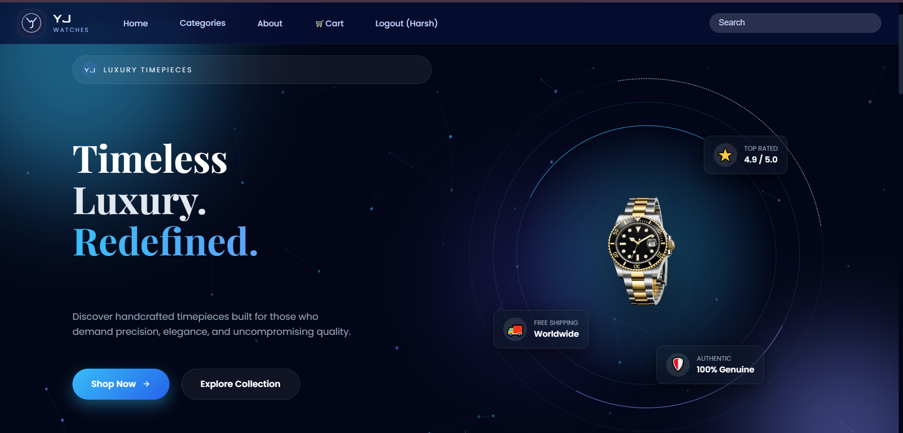
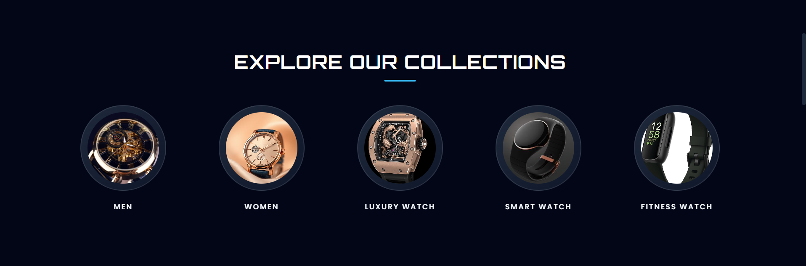
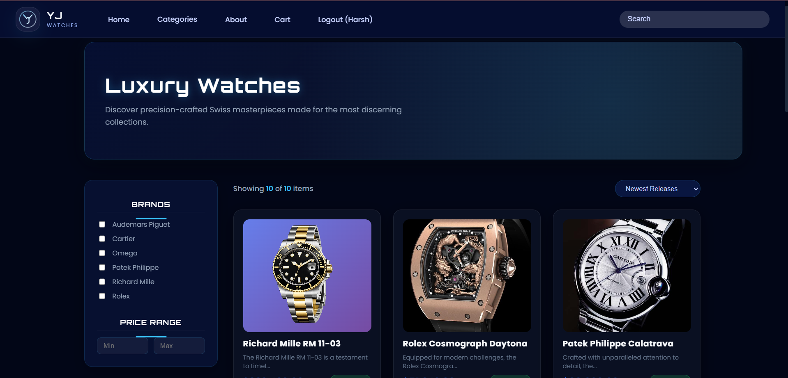
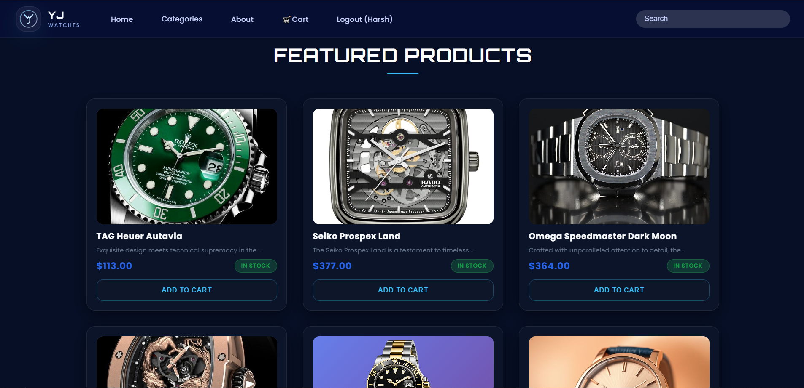
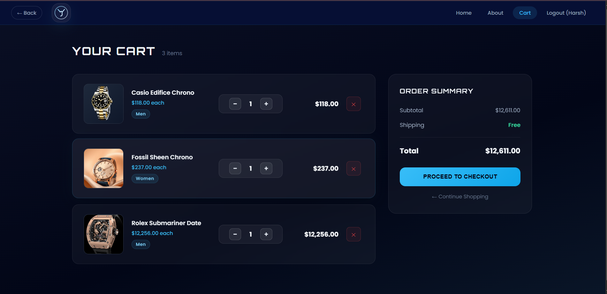
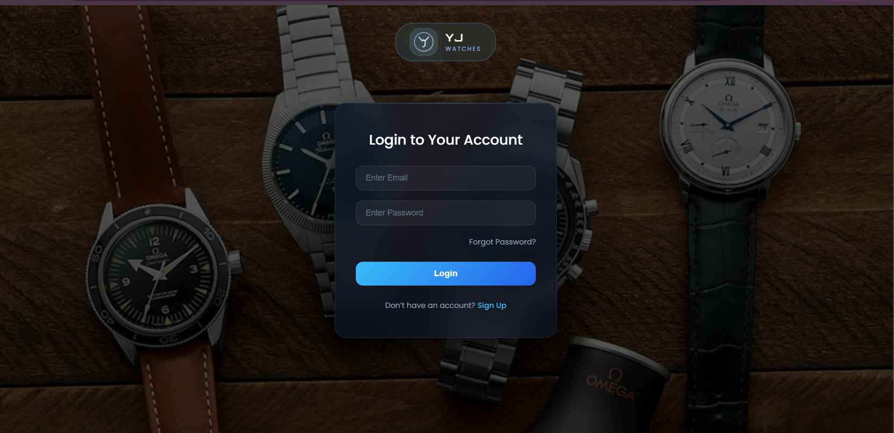
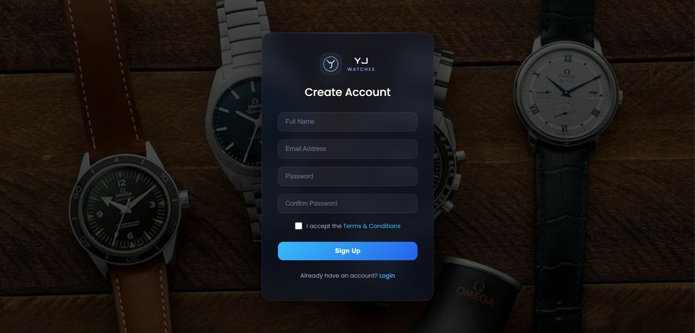
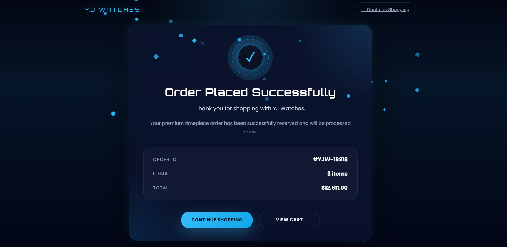
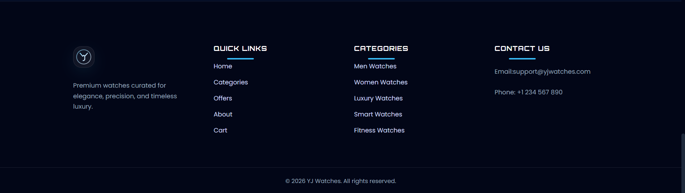

# YJ Watches

Premium futuristic luxury watch e-commerce platform built with the MERN stack.

  

---

## ✨ Project Overview
YJ Watches delivers a premium luxury watch e-commerce experience with a futuristic cyberpunk interface, polished glassmorphism details, and responsive frontend architecture. The project pairs a modern static storefront with a MERN-style backend integration, secure JWT authentication, and a refined shopping flow built for portfolio showcase and recruiter review.

## 🌐 Live Demo
Frontend: Coming Soon  
Backend API: Coming Soon

## 🎯 Feature Status
| Feature | Status |
| --- | --- |
| JWT Authentication | ✅ |
| Login / Signup | ✅ |
| Dynamic Cart | ✅ |
| Quantity Sync | ✅ |
| Search Suggestions | ✅ |
| Category Filtering | ✅ |
| Product Detail Pages | ✅ |
| Responsive Design | ✅ |
| Cyberpunk UI | ✅ |
| Glassmorphism Effects | ✅ |
| Fake Checkout Success Flow | ✅ |
| MongoDB Integration | ✅ |
| Protected Cart Routes | ✅ |

## 🧠 Tech Stack
**Frontend**
- HTML
- CSS
- JavaScript

**Backend**
- Node.js
- Express.js
- MongoDB
- Mongoose
- JWT Authentication

## 🖼️ Screenshots

### Hero Section


### Collections Section


### Categories Section


### Products Section


### Cart Page


### Login Page


### Signup Page


### Order Success Page


### Footer


## 🚀 Installation Guide

### Frontend
1. Open the `frontend` folder.
2. Serve the static files using Live Server or a local static server.
3. Open `index.html` in your browser.

### Backend
1. In a terminal, navigate to the `backend` folder:
   ```bash
   cd backend
   ```
2. Install dependencies:
   ```bash
   npm install
   ```
3. Run the backend server:
   ```bash
   npm run dev
   ```

### MongoDB
- Install MongoDB locally or use MongoDB Atlas.
- Configure the database connection string in `backend/.env`.

### Environment Variables
Create a `.env` file in `backend/` with:
```bash
MONGO_URI=
JWT_SECRET=
PORT=
```

## 📁 Folder Structure
```
YJ-WATCHES/
├── backend/
│   ├── config/
│   ├── controllers/
│   ├── middleware/
│   ├── models/
│   ├── routes/
│   ├── seed.js
│   ├── server.js
│   └── package.json
├── frontend/
│   ├── css/
│   ├── images/
│   ├── js/
│   │   ├── api/
│   │   ├── components/
│   │   ├── pages/
│   │   ├── services/
│   │   └── utils/
│   ├── index.html
│   ├── Home.html
│   ├── product.html
│   ├── cart.html
│   ├── order-success.html
│   └── signup.html
└── README.md
```
## 🔮 Future Improvements
- Razorpay/Stripe Integration
- Wishlist
- Admin Dashboard
- Order History
- Email Verification
- Real Checkout System

---

## 👤 Author
**Yash Jaiman**  
Role: Frontend & MERN Developer

---

## 📄 License
MIT License

Built with passion for futuristic UI/UX, premium branding, and modern MERN development.

---

## 🏷️ Suggested GitHub Topics
mern, ecommerce, mongodb, nodejs, javascript, cyberpunk-ui, glassmorphism, responsive-design